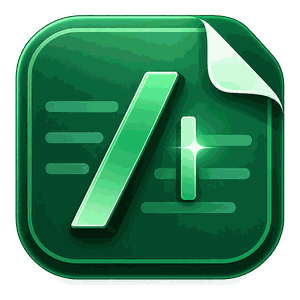

# PromptNote / 提词笺



> 像写文档一样写 Prompt。

PromptNote 是一款本地优先的 Chrome / Edge Side Panel Prompt 编辑器。你可以像写普通文档一样组织 Prompt，不需要先学习 Markdown、XML 或复杂的 Prompt Engineering 语法。

当前正式版本：**1.0.0**

## 主要能力

- 自由富文本编辑；
- 使用 `/` 插入目标、背景、任务、约束、示例、输出格式、验收标准等结构块；
- 选中文字后使用“改清楚 / 缩短 / 拆约束”等可选 AI 辅助；
- 主动开启 IDE 风格内联补全，`Tab` 接受、`Esc` 忽略；
- 本地 Prompt Check；
- Plain Text / Markdown / XML 预览与复制；
- 多 Prompt 本地保存、自动保存、JSON 备份与恢复。

PromptNote 不向 ChatGPT、Claude、Gemini 等第三方网页输入框自动注入内容，也不会自动发送 Prompt。外部交付统一通过 **Copy** 完成。

## 安装

### 当前发行包

在浏览器商店上架前，可以使用仓库 CI 生成的正式构建：

1. 打开本仓库 **Actions**；
2. 进入最新成功的 `ci`；
3. 下载 `promptnote-1.0.0` artifact；
4. 解压；
5. Chrome 打开 `chrome://extensions`，Edge 打开 `edge://extensions`；
6. 开启开发者模式并选择“加载已解压的扩展程序”。

浏览器商店版本上线后，普通用户应优先通过商店安装和自动更新。

### 从源码构建

仅开发者需要：

```bash
npm ci
npm run build
```

构建输出位于 `dist/`。

## 基本使用

### 直接写

打开 Side Panel 后即可输入。标题可以直接修改，正文自动保存到浏览器扩展本地存储。

### 使用 `/` 结构化

在块首、行首或空白后输入 `/` 会打开结构菜单，可用方向键选择并按 `Enter` 插入。

普通正文中的 `/` 保持普通字符，例如：

```text
https://openai.com
2026/08/10
A/B 测试
```

如果菜单打开后只是想输入普通 `/`，按 `Esc` 即可。

### 使用 AI（可选）

AI 不是核心编辑能力的前置条件。未配置、关闭或调用失败时，编辑、保存、检查、预览和复制仍可使用。

PromptNote 支持 OpenAI-compatible / Anthropic Provider。用户自行配置 Provider、Model、API Base URL 与 API Key。

只有两类场景会向 AI Provider 发送内容：

- 用户主动执行 AI 建议或 AI 检查；
- 用户已配置 AI，并主动开启“编辑器内联补全”。

内联补全默认关闭。

### 备份与 Browser / Desktop 迁移

Prompt 文档默认保存在当前宿主自己的本地存储中。Browser 使用扩展本地存储；Windows Desktop V1 使用独立本地 SQLite。**两边数据彼此独立，不会自动同步。**

Browser 与 Windows Desktop 使用同一份 Prompt JSON backup contract。需要在两边迁移 Prompt 时，使用手动 JSON 备份即可：

1. 在来源端的 Prompt 列表中导出 JSON 备份；
2. 在目标端选择导入该 JSON；
3. 如果目标端已有相同 ID，PromptNote 会询问是覆盖还是另存为导入副本；
4. 选择覆盖时会重新提升 revision，避免较旧备份以较低 revision 覆盖当前版本。

因此 Browser 导出的备份可以导入 Desktop，Desktop 导出的备份也可以导回 Browser。JSON 备份只包含 PromptDocument，不包含 AI API Key、Windows 设置或其它 SecretStore 内容。

PromptNote V1 没有 PromptNote 账号、云端数据后端，也没有 Browser / Desktop 自动同步。跨宿主迁移始终由用户明确导出、导入。

## 隐私与权限

PromptNote 没有自有账号、后端、云数据库、广告或第三方统计 SDK。AI 请求直接发往用户配置的 Provider。

固定 Manifest 权限只有：

```text
storage
sidePanel
```

AI 自定义地址使用 optional host permission。PromptNote 不需要 `activeTab`、`scripting` 或第三方网页 content script。

完整说明见 [`PRIVACY.md`](PRIVACY.md)。

## 已知限制

- 当前没有账号、云同步、多设备同步或 Browser / Desktop 自动同步；
- `chrome.storage.local` 不是专用加密保险库；
- AI 效果、速度与可用性取决于用户配置的 Provider、Model、网络和额度；
- Side Panel 可用宽度由浏览器宿主控制。

## 版本说明

见 [`docs/RELEASE-NOTES-1.0.0.md`](docs/RELEASE-NOTES-1.0.0.md)。

## 开发与维护

维护者资料位于 `docs/`：

- `PRODUCT.md`
- `UX.md`
- `PROMPT-DOCUMENT-CONTRACT.md`
- `ARCHITECTURE.md`
- `DECISIONS.md`

AI / Agent 参与维护前请阅读 [`AGENTS.md`](AGENTS.md)。发布操作见 [`docs/PUBLISHING.md`](docs/PUBLISHING.md)。

## 授权

PromptNote 源码采用 [Mozilla Public License 2.0](LICENSE)（`MPL-2.0`）发布。该许可证允许使用、修改、再分发和商业使用，并要求分发时继续按 MPL-2.0 提供受该许可证覆盖的源码文件及其修改。第三方依赖仍遵循各自许可证。