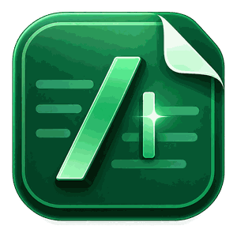
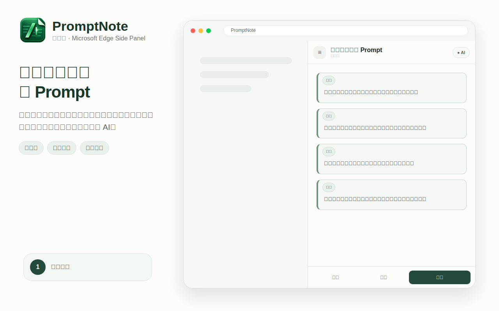
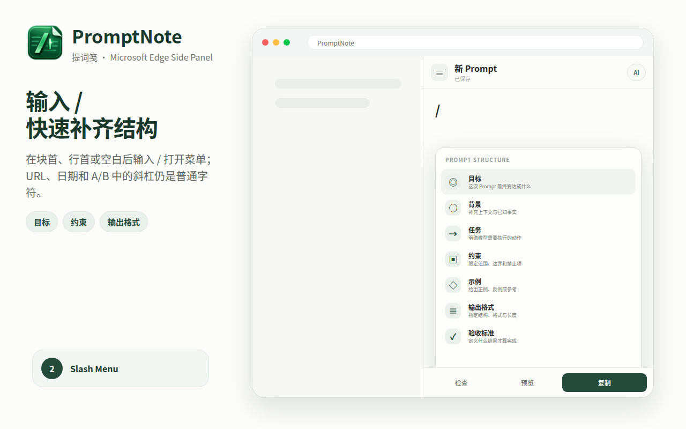
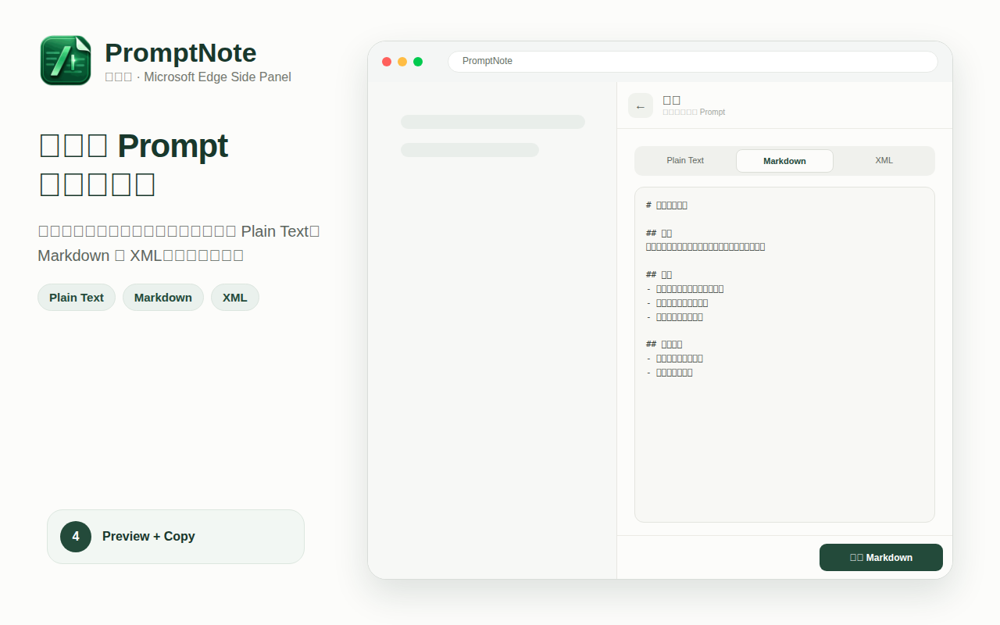
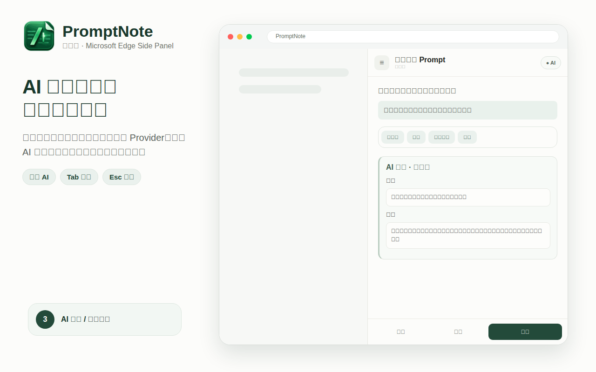

<p align="center">
  
</p>

<h1 align="center">PromptNote / 提词笺</h1>

<p align="center">
  <strong>像写文档一样写 Prompt。</strong><br>
  Write prompts like documents, not giant text boxes.
</p>

<p align="center">
  一个本地优先的 Chrome / Edge Side Panel Prompt 编辑器：自由写作、结构化、检查、预览并复制，不要求先学 Markdown、XML 或复杂的 Prompt Engineering 语法。
</p>

<p align="center">
  <a href="https://microsoftedge.microsoft.com/addons/detail/promptnote-%E6%8F%90%E8%AF%8D%E7%AC%BA/anfinlneeljjcbaehlknppeidggbonhk"><strong>安装 Edge 商店版</strong></a>
  ·
  <a href="#快速开始">快速开始</a>
  ·
  <a href="PRIVACY.md">隐私说明</a>
</p>

<p align="center">
  
  
  
  
</p>

<p align="center">
  
</p>

> 如果 PromptNote 对你有帮助，欢迎点一个 ⭐ **Star**。它能让更多需要结构化写 Prompt 的人发现这个项目。

## 为什么做 PromptNote

很多 Prompt 最后都会变成一个越来越长的文本块：目标、背景、任务、限制、示例、输出格式全部挤在一起，越改越难读。

PromptNote 的思路很简单：**Prompt 本质上也是文档。**

你可以先像写普通文档一样写，再按需要加入结构；工具帮助你整理和检查，但不会抢走作者控制权。

| 普通大文本框 | PromptNote |
| --- | --- |
| 内容越长越难定位 | 用目标、背景、任务、约束等结构块组织 |
| 需要自己维护 Markdown / XML | 正常写作即可，最后再预览 / 编译 |
| Prompt 与工具强绑定 | 统一 Copy，交给 ChatGPT、Claude、Gemini 或其他工具 |
| AI 不可用时工作流容易中断 | AI 完全可选，编辑、保存、检查、预览、复制始终可用 |
| 数据经常依赖账号或云端 | Prompt 默认保存在浏览器扩展本地存储 |

## 核心工作流

**写 → 结构化 → 检查 → 预览 / 编译 → Copy**

<p>
  
  
</p>

<p>
  
</p>

## 主要能力

- **自由富文本编辑**：先写内容，不需要先学习一套 Prompt 语法。
- **`/` 结构菜单**：快速插入目标、背景、任务、约束、示例、输出格式、验收标准等结构块。
- **Prompt Check**：在本地检查结构和常见问题。
- **多格式预览与复制**：Plain Text / Markdown / XML。
- **可选 AI 辅助**：选中文字后执行“改清楚 / 缩短 / 拆约束”等操作。
- **可选内联补全**：主动开启后使用，`Tab` 接受、`Esc` 忽略；默认关闭。
- **多 Prompt 本地保存**：自动保存，并支持 JSON 备份与恢复。
- **低权限设计**：固定 Manifest 权限只有 `storage` 与 `sidePanel`。

PromptNote **不会**向 ChatGPT、Claude、Gemini 等第三方网页输入框自动注入内容，也不会自动发送 Prompt。外部交付统一通过 **Copy** 完成。

## 快速开始

### 1. Edge 用户：直接安装

PromptNote 已发布到 Microsoft Edge Add-ons：

**[安装 PromptNote / 提词笺](https://microsoftedge.microsoft.com/addons/detail/promptnote-%E6%8F%90%E8%AF%8D%E7%AC%BA/anfinlneeljjcbaehlknppeidggbonhk)**

当前 Edge 商店版本为 **1.0.0**；仓库 Manifest 已推进到 **1.0.1**。商店升级完成前，以商店页面实际版本为准。

### 2. Chrome / Edge：体验仓库当前构建

1. 打开本仓库 **Actions**。
2. 进入最新成功的 `ci`。
3. 下载 `promptnote-1.0.1` artifact 并解压。
4. Chrome 打开 `chrome://extensions`，Edge 打开 `edge://extensions`。
5. 开启开发者模式，选择“加载已解压的扩展程序”。

当前要求 Chrome **116+**。

### 3. 从源码构建

仅开发者需要：

```bash
npm ci
npm run build
```

构建输出位于 `dist/`。

## 怎么用

### 直接写

打开 Side Panel 后即可输入。标题可以直接修改，正文自动保存到浏览器扩展本地存储。

### 用 `/` 加结构

在块首、行首或空白后输入 `/` 会打开结构菜单，可用方向键选择并按 `Enter` 插入。

普通正文里的 `/` 仍然只是普通字符，例如：

```text
https://openai.com
2026/08/10
A/B 测试
```

如果菜单打开后只是想输入普通 `/`，按 `Esc` 即可。

### AI 是可选的

PromptNote 支持 OpenAI-compatible / Anthropic Provider。你可以自行配置 Provider、Model、API Base URL 与 API Key。

只有两类场景会向 AI Provider 发送内容：

- 你主动执行 AI 建议或 AI 检查；
- 你已经配置 AI，并主动开启编辑器内联补全。

未配置、关闭或调用失败时，**编辑、保存、检查、预览和复制仍然可以正常使用**。

## 本地优先与隐私

PromptNote 没有自有账号、后端、云数据库、广告或第三方统计 SDK。Prompt 文档默认保存在浏览器扩展本地存储；AI 请求直接发往你配置的 Provider。

固定 Manifest 权限：

```text
storage
sidePanel
```

AI 自定义地址使用 optional host permission。PromptNote 不需要 `activeTab`、`scripting` 或第三方网页 content script。

完整说明见 [`PRIVACY.md`](PRIVACY.md)。

> `chrome.storage.local` 不是专用加密保险库。重要 Prompt 建议定期导出 JSON 备份。

## 当前版本

| 项目 | 状态 |
| --- | --- |
| 仓库 Manifest | `1.0.1` |
| Edge Add-ons | `1.0.0` |
| Manifest | V3 |
| Minimum Chrome | `116` |
| License | MPL-2.0 |

版本说明：[`1.0.1`](docs/RELEASE-NOTES-1.0.1.md) · [`1.0.0`](docs/RELEASE-NOTES-1.0.0.md)

## 开发与维护

维护者资料位于 `docs/`：

- [`PRODUCT.md`](docs/PRODUCT.md)
- [`UX.md`](docs/UX.md)
- [`PROMPT-DOCUMENT-CONTRACT.md`](docs/PROMPT-DOCUMENT-CONTRACT.md)
- [`ARCHITECTURE.md`](docs/ARCHITECTURE.md)
- [`DECISIONS.md`](docs/DECISIONS.md)

AI / Agent 参与维护前请阅读 [`AGENTS.md`](AGENTS.md)。发布操作见 [`docs/PUBLISHING.md`](docs/PUBLISHING.md)。

## License

PromptNote 源码采用 [Mozilla Public License 2.0](LICENSE)（`MPL-2.0`）发布。该许可证允许使用、修改、再分发和商业使用，并要求分发时继续按 MPL-2.0 提供受该许可证覆盖的源码文件及其修改。第三方依赖仍遵循各自许可证。
